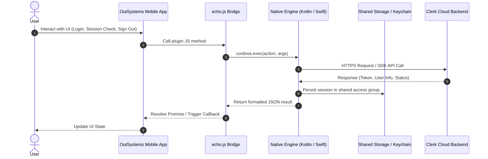
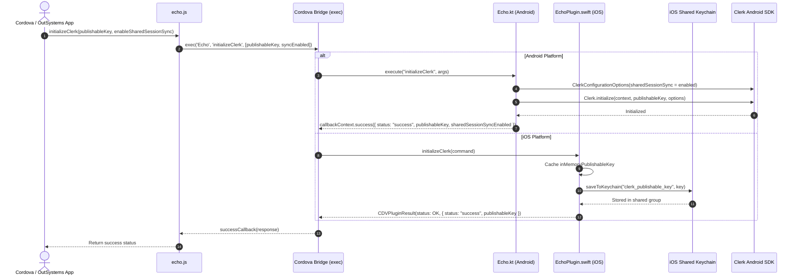
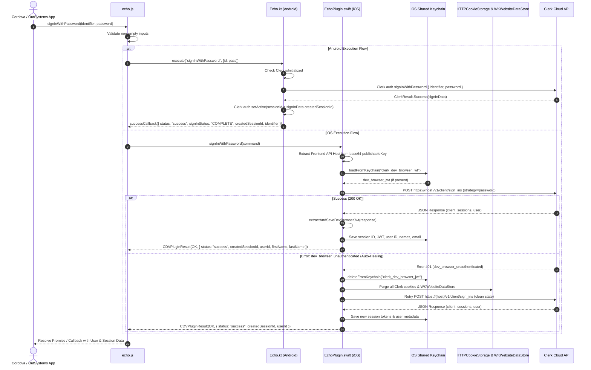
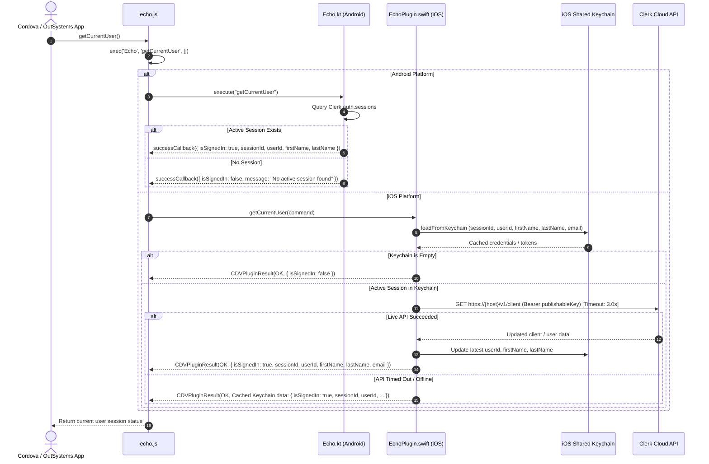
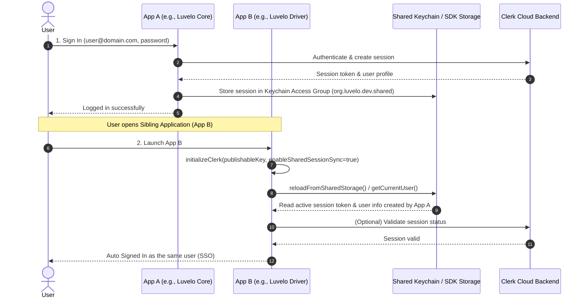
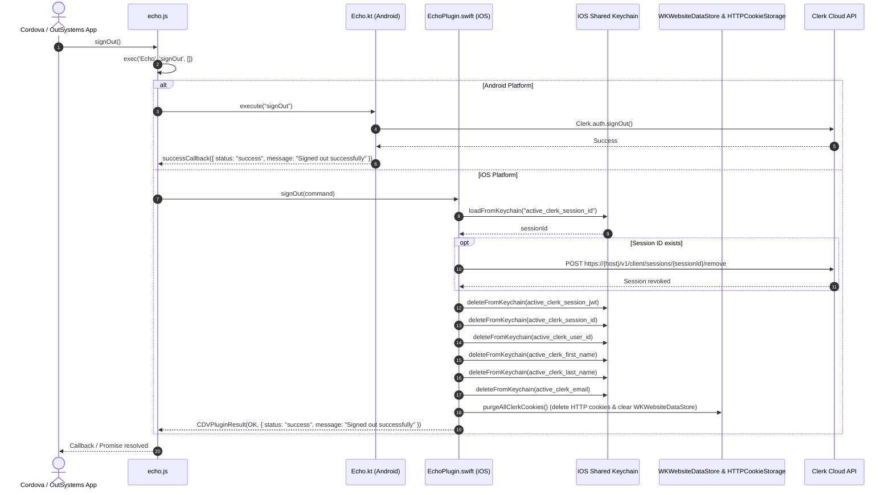
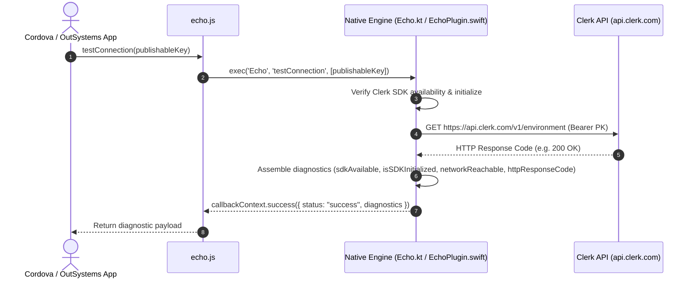

# Clerk Authentication & Shared Session Implementation Guide (`cordova-plugin-echo`)

This document provides a comprehensive technical overview, implementation architecture, and complete sequence diagrams for the Clerk Cordova plugin (`cordova-plugin-echo`).

---

## 📑 Table of Contents

1. [Architectural Overview](#1-architectural-overview)
2. [Component Structure & Responsibilities](#2-component-structure--responsibilities)
3. [Platform-Specific Implementations](#3-platform-specific-implementations)
   - [Android: Kotlin Engine & Clerk Android SDK](#android-kotlin-engine--clerk-android-sdk)
   - [iOS: Swift REST Engine & Shared Keychain Access Group](#ios-swift-rest-engine--shared-keychain-access-group)
4. [Complete Sequence Diagrams](#4-complete-sequence-diagrams)
   - [1. High-Level Architecture Diagram](#1-high-level-architecture-diagram)
   - [2. Initialization Flow (`initializeClerk`)](#2-initialization-flow-initializeclerk)
   - [3. Sign In Flow (`signInWithPassword`)](#3-sign-in-flow-signinwithpassword)
   - [4. Query Active Session & Live Profile Refresh (`getCurrentUser`)](#4-query-active-session--live-profile-refresh-getcurrentuser)
   - [5. Cross-App Single Sign-On (SSO) Flow (`reloadFromSharedStorage`)](#5-cross-app-single-sign-on-sso-flow-reloadfromsharedstorage)
   - [6. Sign Out Flow (`signOut`)](#6-sign-out-flow-signout)
   - [7. Diagnostics & Connectivity Flow (`testConnection` / `checkClerk`)](#7-diagnostics--connectivity-flow-testconnection--checkclerk)
5. [Auto-Healing on iOS (`dev_browser_unauthenticated`)](#5-auto-healing-on-ios-dev_browser_unauthenticated)
6. [OutSystems MABS Integration & Keychain Entitlements](#6-outsystems-mabs-integration--keychain-entitlements)

---

## 1. Architectural Overview

The plugin bridges hybrid web applications (such as OutSystems Reactive/Mobile or Apache Cordova) to Clerk Authentication services with native performance and cross-app session sharing.

```mermaid
graph TD
    App["OutSystems / Cordova Web Client"] -->|window.echo / cordova.plugins.echo| JS["echo.js (JS Interface)"]
    JS -->|cordova.exec| Bridge["Cordova Native Bridge"]
    Bridge -->|Android Action Dispatch| Kotlin["Echo.kt (Android Kotlin Engine)"]
    Bridge -->|iOS Action Dispatch| Swift["EchoPlugin.swift (iOS Swift Engine)"]
    Kotlin -->|Clerk Android SDK 1.1.1| ClerkBackend["Clerk Cloud Auth Backend"]
    Swift -->|HTTPS REST API (api.clerk.com / FAPI)| ClerkBackend
    Swift -->|SecItemAdd / SecItemCopyMatching| Keychain["iOS Shared Keychain (org.luvelo.dev.shared)"]
    Kotlin -->|SharedSessionSyncConfig| AndroidStorage["Android SDK Shared Storage"]
```

---

## 2. Component Structure & Responsibilities

| File Path | Component | Responsibility |
|---|---|---|
| [`www/echo.js`](file:///d:/Downloads/clerk-native-sdk-plugin/www/echo.js) | JavaScript Interface | Exposes standard JavaScript methods on `window.echo` and `cordova.plugins.echo`. Handles argument validation and delegates to `cordova.exec`. |
| [`src/android/org/apache/cordova/plugin/echo/Echo.kt`](file:///d:/Downloads/clerk-native-sdk-plugin/src/android/org/apache/cordova/plugin/echo/Echo.kt) | Android Native Engine | Uses official `com.clerk:clerk-android-api:1.1.1` via Kotlin Coroutines. Integrates `SharedSessionSyncConfig.enabled` for cross-app session synchronization. |
| [`src/ios/EchoPlugin.swift`](file:///d:/Downloads/clerk-native-sdk-plugin/src/ios/EchoPlugin.swift) | iOS Native Engine | Implements native Clerk Frontend REST API calls, extracts API hosts from publishable keys, stores sessions in shared Keychain Access Groups, and handles automatic recovery from dev browser cookie issues. |
| [`plugin.xml`](file:///d:/Downloads/clerk-native-sdk-plugin/plugin.xml) | Plugin Manifest | Configures Android permissions, Gradle Kotlin dependencies, and automatically registers iOS Keychain Access Group entitlements (`$(AppIdentifierPrefix)org.luvelo.dev.shared`) for OutSystems MABS cloud builds. |

---

## 3. Platform-Specific Implementations

### Android: Kotlin Engine & Clerk Android SDK
- **Dependency**: `com.clerk:clerk-android-api:1.1.1`
- **Session Sync**: Configured through `ClerkConfigurationOptions(sharedSessionSync = SharedSessionSyncConfig.enabled)`.
- **Concurrency**: Operations run on background coroutines via `Dispatchers.IO` wrapped in `cordova.threadPool`.
- **Error Handling**: Automatically extracts descriptive messages from `ClerkResult.Failure`.

### iOS: Swift REST Engine & Shared Keychain Access Group
- **Keychain Service**: `com.luvelo.clerk.sharedservice`
- **Keychain Access Group**: `org.luvelo.dev.shared`
- **Frontend API Host Resolution**: Dynamically extracts and decodes the Clerk Frontend API domain from the base64-encoded publishable key (`pk_test_...` or `pk_live_...`).
- **State Storage**:
  - `active_clerk_session_jwt`
  - `active_clerk_session_id`
  - `active_clerk_user_id`
  - `active_clerk_first_name`
  - `active_clerk_last_name`
  - `active_clerk_email`
  - `clerk_publishable_key`
  - `clerk_dev_browser_jwt`

---

## 4. Complete Sequence Diagrams

### 1. High-Level Architecture Diagram



---

### 2. Initialization Flow (`initializeClerk`)

Initializes the Clerk engine on the native layer and enables cross-application shared session synchronization.



---

### 3. Sign In Flow (`signInWithPassword`)

Authenticates the user with email/username and password, creates the active session, and saves session tokens to shared storage/Keychain.



---

### 4. Query Active Session & Live Profile Refresh (`getCurrentUser`)

Retrieves the currently authenticated user's session metadata and status. On iOS, performs a live revalidation against Clerk.



---

### 5. Cross-App Single Sign-On (SSO) Flow (`reloadFromSharedStorage`)

Demonstrates how two sibling apps share a single login session without re-prompting the user.



---

### 6. Sign Out Flow (`signOut`)

Revokes the session with the Clerk server, deletes shared Keychain records, and clears all WebKit cookies and data stores.



---

### 7. Diagnostics & Connectivity Flow (`testConnection` / `checkClerk`)

Tests native SDK availability and live network connectivity to `https://api.clerk.com/v1/environment`.



---

## 5. Auto-Healing on iOS (`dev_browser_unauthenticated`)

In development Clerk instances, session tokens are tied to a `_clerk_db_jwt` browser cookie/token. When a development session expires or a database resets, Clerk returns:

```json
{
  "errors": [
    {
      "code": "dev_browser_unauthenticated",
      "message": "Dev browser unauthenticated",
      "long_message": "The development browser session has expired."
    }
  ]
}
```

The iOS native engine handles this transparently via `purgeAllClerkCookies()`:
1. Clears `clerk_dev_browser_jwt` from Keychain.
2. Removes all cookies from `HTTPCookieStorage.shared`.
3. Clears data from `WKWebsiteDataStore.default()`.
4. Automatically retries the authentication request with a fresh state.

---

## 6. OutSystems MABS Integration & Keychain Entitlements

The plugin automatically configures the Apple Keychain Sharing Entitlements inside [`plugin.xml`](file:///d:/Luvelo/Plugins/clerk-testing-testing/plugin.xml):

```xml
<config-file target="**/Entitlements-Debug.plist" parent="keychain-access-groups">
    <array>
        <string>$(AppIdentifierPrefix)org.luvelo.dev.shared</string>
    </array>
</config-file>

<config-file target="**/Entitlements-Release.plist" parent="keychain-access-groups">
    <array>
        <string>$(AppIdentifierPrefix)org.luvelo.dev.shared</string>
    </array>
</config-file>
```

When building sibling apps in OutSystems MABS with the same Apple Developer Team Certificate, both apps share the same Keychain partition, enabling instantaneous Single Sign-On.
